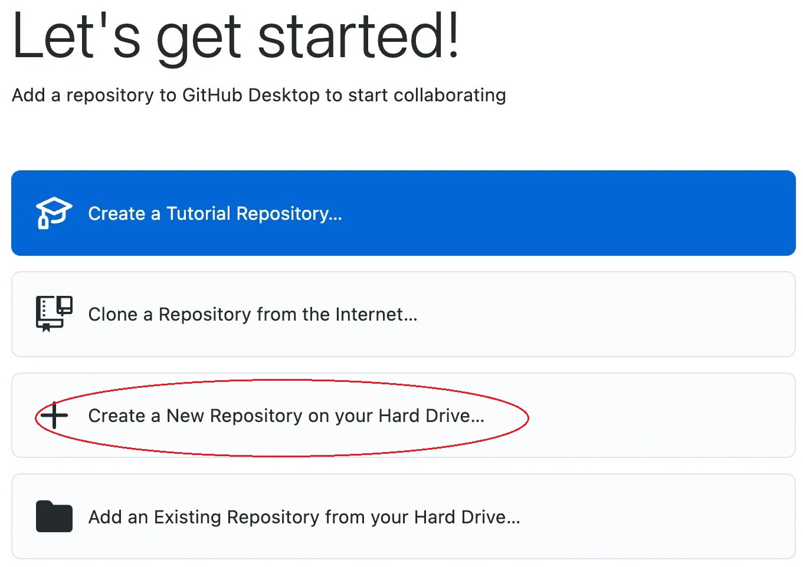
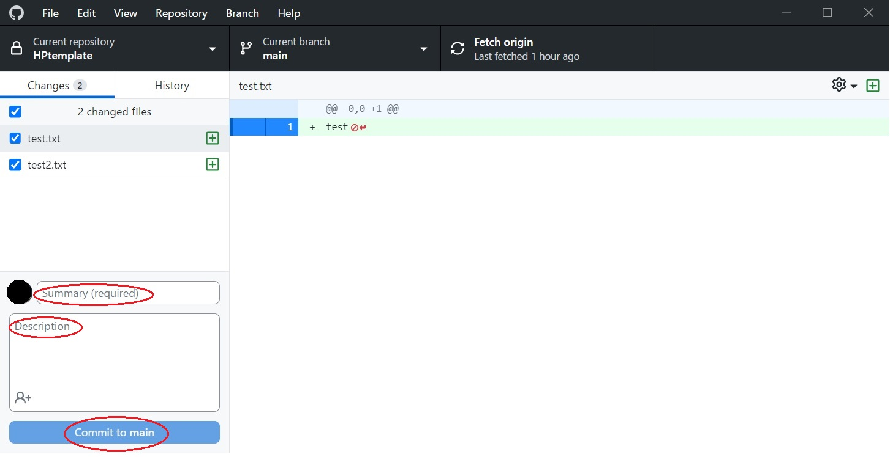

# GitHub Pagesを使ったWebページ公開マニュアル

GitHub Pagesとは、GitHub社が提供している静的Webページのためのホスティングサービスです。  
特徴としては

- ドメイン(github.io)とサーバが初期費用と維持費用ゼロで利用できる  
- 独自ドメインを利用することも可能  
- ソースコードが変更履歴とともに公開される  

といったことが挙げられます。  

本マニュアルでは、GitHubアカウントの作成、GitHub Desktopを使用したローカルでの作業環境構築、サンプルページの公開までの手順を解説します。  

## ステップ1: GitHubアカウントの作成

GitHub Pagesを利用するにあたってまずGitHubのアカウントを作成する必要があります。  

1. **GitHubのWebサイトにアクセス**
    - [GitHubのWebサイト](https://github.com/)にアクセスします。

2. **サインアップ**
    - 「Sign up」ボタンをクリックします。
    - 必要な情報（ユーザ名、メールアドレス、パスワード）を入力し、GitHubアカウントを作成します。  
    - **ここで設定するユーザ名が公開するWebページのURLに反映されます**  
    例）ユーザ名を *academeia* にした場合  
    「https:// *academeia* .github.io/index.html/」  

**WARNING**  
上記の例で *academeia* の部分を変更したい場合にはGitHubアカウントを新しく作り直す必要があります。

## ステップ2: GitHub Desktopのインストール

GitHubとGitHub Pagesはブラウザでも利用できますが、作業をするには不便なので手元のPCで作業できるようにするために **GitHub Desktop** をインストールします。  

1. **GitHub Desktopのダウンロード**
    - [GitHub Desktopのダウンロードページ](https://desktop.github.com/)にアクセスします。
    - OS（WindowsまたはMac）に適したバージョンをダウンロードします。

2. **インストール**
    - ダウンロードしたファイルを実行し、指示に従ってインストールを完了させます。

3. **ログイン**
    - GitHub Desktopを開き、「Sign in to GitHub.com」をクリックしてGitHubアカウントでログインします。

## ステップ3: リポジトリの作成

GitHub PagesでWebページを公開するためにはデータの保管場所である **リポジトリ** を作成する必要があります。

1. **新規リポジトリの作成**
    - 初めてGitHub Desktopを使う場合は「+ Create New Repository on your Hard Drive」をクリックします
    - チュートリアルが表示されない場合には「File」メニューから「New repository」を選択します。

1. **リポジトリ情報の入力**
    - 「name」は **ユーザ名.github.io** にしてください  
    ※ユーザ名はGitHubアカウント作成時に設定したものです  
    - 「Description」は省略可能です
    - 「Local path」（保存先）を設定します。  
    ※Windowsの場合、デフォルトでは*ドキュメント*の中に*GitHub*フォルダが作成され、その中にある*ユーザ名.github.io*が保存先に設定されます。  
    - 「Create repository」をクリックします。

2. **パブリッシュ**
    - ローカルで作成したリポジトリをGitHub上に反映させるためにパブリッシュします。「Publish repository」をクリックし、出てきたウインドウでも「Publish repository」をクリックします。  

## ステップ4: Webページの作成

テンプレートのデータをローカルリポジトリに移動させGitHubにプッシュします。  

1. **ローカルリポジトリにファイルを追加**
    - 作成したリポジトリのディレクトリ（デフォルトの場合、ドキュメント>GitHub>ユーザ名.github.io）を開きます。GitHub Desktopの「Show in Explorer」でも開くことができます。

    - [テンプレート配布ページ]()からダウンロードした2つのデータ（assetsフォルダとindex.html）を上記に移動します。  
  
**WARNING**  
このフォルダに入れたデータはGitHubを通じて **全世界に公開されます** 。後にデータを消しても **ログはずっと残ってしまう** のでデータの扱いにはくれぐれも注意してください。

1. **変更のコミット**
    - GitHub Desktopの左側「Changes」には更新されたファイルの一覧が表示されます。ファイルを選択すると右側に変更箇所が表示されます。
    - ファイル一覧の下の「Summary(requited)」とある入力欄には今回の変更がどのような変更なのか手がかりとなるような記述を行います。内容はなんでも構いませんが、たとえば「テンプレート追加」のように何をしたのかわかりやすい記述が好ましいです。  
    その下の「Description」は省略可能です。
    - 「Commit to main」をクリックして変更を確定します。

1. **プッシュ**
    - 「Repository」メニューから「Push」を選択、もしくは「Push origin」をクリックしローカルリポジトリの変更をGitHubにプッシュします。処理が完了するまでにしばらく時間がかかりますが、これでローカルリポジトリの変更をGitHub上に反映させることができます。  

## ステップ5: GitHub Pagesで公開

GitHubではリポジトリを公開する　**Public** と非公開にする **Private** の2つのモードがあります。GitHub Pagesを公開するには **Public** に設定を変更する必要があります。  

1. **GitHubでリポジトリにアクセス**
    - GitHub Desktopにある「View on Github」ボタン、もしくは「Repository」メニューの「View on Github」を選択し、ブラウザでリポジトリを開きます。

2. **GitHub Pagesの設定**   
    - 上部にある⚙settingsをクリックします。  

    - 「General」最下段の **Danger Zone** にある「Change repository visibility」の「Change visibility」をクリックします。

    - 表示されたリポジトリ名を確認し「I want to make repository public」をクリックします。

これでGitHub PagesでWebページが公開されます。初回は変更箇所も多く反映されるまで数分かかりますが、しばらくすると **https://ユーザ名.github.io/** でWebページにアクセスできるようになります。  
なお、このままだと不完全なHTMLのまま公開しつづけることになってしまいますので、公開できることを確認した後に上記と同様の手順でPublicからPrivateに変更した上でHTML編集を行うことをお勧めします。  

[テンプレート編集 マニュアル](../md/webtemplate.md) へ続く
